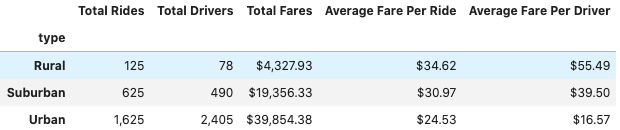
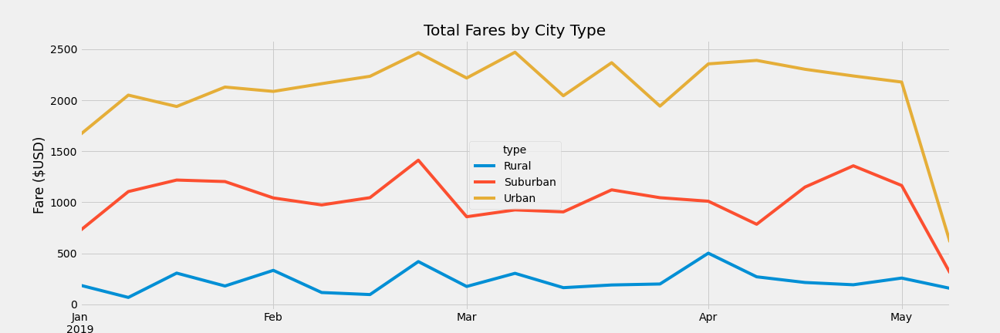

# PyBer_analysis

### Overview 

The purpose of this analysis was to see te ride trends in the different city types and how it correlates to fare prices, ride counts, and driver counts. V. Isualize would like to see these trends based on Rural, Suburban, and Urcan city types. The data may be able to provide actionable insights as to where to and where not to invest/expand.

### Results

A summary and line graph of the total rides,total drivers, total fares, average fare per ride, average fare per driver. 

  
  
  
  
  
  
  
  As seen in the graph urban cities contribute the most fares followed suburban cities.  
 The data suggests more expansion within urban cities is the most logical insight from this data. Establishing a stronger presence   in suburban cities should also be considered. 
 Rural cities have the most expensive rides and fewest rides. This suggest rural populations prefer to drive themselves. I would caution against expanding in rural cities. 
 
### Limitation of the data set
Analyzing wait times for customers my be worth looking into. For example. if there is long wait times in urban or suburban cities it may mean there is need for more drivers. Looking at customer service surveys in city types may also be benefecial to see is there is a business limiation. 
 

